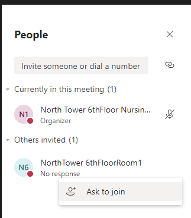

# Virtual Rounds Breaking Change in Microsoft Teams Meeting Experience

As of April 6th or 7th, 2020, there appears to be a breaking change to an underlying client behavior (initially potentially isolated to iOS devices), in which Patients' Rooms are being disconnected from meetings approximately 30 minutes after a care provider is removed from the meeting.

We are working diligently with Microsoft to attempt to resolve this issue and to determine if we can expect this configuration to be reverted; or if this change is permanent.

Below are some initial workarounds KiZAN has been able to develop for the "meeting disconnect" scenario. Hopefully the below are temporary workarounds, as none are perfect, but we wanted to share what we've put together so far. Each solution is "stand alone", with it's own benefits and drawbacks; you would not need to implement each of these, however testing each to determine which might be the best solution for your providers and patients is highly recommended. KiZAN is here to support you however we can in getting this resolved ASAP; and Microsoft is working diligently to see if they are able to roll-back the change that occurred it as well as to evaluate additional workarounds.

KiZAN is working actively on other options to be considered, which we will provide as soon as they are vetted.  Similarly if your organization is able to come up with other creative solutions, please feel free to share them directly with us (even if it's just an idea and hasn't been vetted), as I would love to put our heads together on this.

## Option A – Third Meeting Account

First, establish an account such as "MeetingOrganizerBuilding1Floor1".  Create unique "Profiles" in your browser of choice (Chrome, Firefox, New Edge all support this) and have each profile signed into the the room meeting. This device should join with audio off, incoming video disabled, and would need to be physically secured (such as in an IT closet or similar), but would essentially "hold" the meetings open along with the patient room.

Each meeting joining would need to be re-joined each 24 hours as the clients time-out. (Actively testing 2020.04.07 PM how long we can expect browser sessions to remain open).

This would in essence ensure that the meeting is never down to one participant, working around this issue temporarily.

### Benefits of Third Meeting Account

There would be no patient interaction required (as today) to join into the provider meeting.  Providers and patients would not require additional training/communications.
Ideal solution if you only have a few dozen rooms/devices you would need to keep alive.

### Drawbacks of Third Meeting Account

Extensive IT intervention every 24 hours to re-arm multiple meetings would be required.
Doesn't scale well with  large quantities of meetings to "keep open", unsure of how long these Chrome sessions could stay connected to a meeting (or how many meetings a single device could support).

## Option B – Leverage Calls Rather than Meetings

Update the "Join" meeting column, rather than pointing to the individual meeting to a "Call" link (which you can create by appending the Room email account to the static string: `https://teams.microsoft.com/l/call/0/0?users=`
, for example `https://teams.microsoft.com/l/call/0/0?users=NorthTower6thFloorRoom1@M365x107527.onmicrosoft.com`.
When a provider is ready to conduct a virtual meeting with a patient, he will click this link and the patient will need to "Answer" the call to initiate care.  
    If you are using iOS devices, you can look into the accessibility feature, "Auto Answer" to initiate the voice call automatically, requiring the patient to only click the "Camera" icon the meeting to enable video.  
    
To ensure the patient is ready to join, you can rely on your existing in-room audio functions to "page" the patient to be on the lookout for the incoming call.
You may want to consider the in-room providers updating the Teams client in each room (or configuring via the provisioning process) a longer period than the default 20-seconds a call will ring before being marked as "Unanswered"

### Benefits of Calls

Patients answer the call, allowing video only when they are prepared for it

### Drawbacks of Calls

Patients must touch the device to enable camera (and answer the call on non-iOS devices).  A mouse/keyboard, or Bluetooth speakerphone could be used to not require direct device interaction, but will not fully remove this.
Until KiZAN/Microsoft can provide updated provisioning scripts; the "Join" link will need to be manually populated for each Room.

## Option C – "Ask to Join" Meeting

Should a patient room be disconnected from a meeting, the care provider can use the "Ask to Join" button on their device to "ring" the patient's device, asking them to rejoin the meeting

### Benefits of "Ask to Join"

Patients answer the call, allowing video only when they are prepared for it.

No need to reconfigure all meeting links provisioned in the system.

### Drawbacks of "Ask to Join"

Patients must touch the device to enable camera (and answer the call on non-iOS devices).

A mouse/keyboard, or Bluetooth speakerphone could be used to not require direct device interaction, but will not fully remove this.
