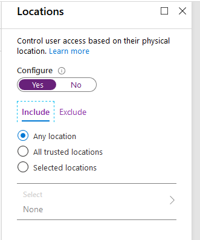
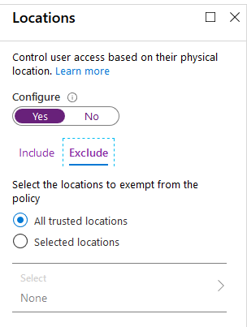
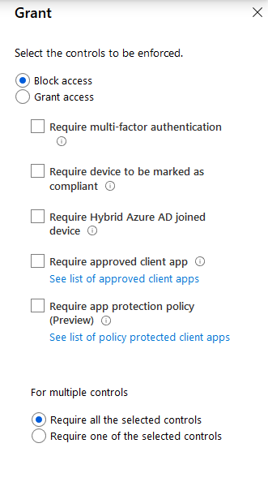

# Virtual Rounding using Microsoft Teams

_Version: 1.1
Updated 4/8/2020_

## Changelog

### Version 1.1

Date: 4/8/2020

- All scripts now have added delays after crucial steps to ensure provisioning of resources, and extra catches to ensure more time is given for provisioning when necessary.
- All scripts no longer need direct modification for variables. A single JSON file is used for all variables, and scripts shouldn't need modifications unless you have desired customizations.
- Bug identified causing meetings to end in the following situation:
  - Room sitting in meeting -> Provider Joins for a certain period of time -> Provider leaves meeting -> Meeting ends 30 minutes later if no other providers join (only one user in the meeting)
  - A new part of the Virtual Rounding solution has been added to solve this bug. There is now a free meeting bot you can deploy to always be joined to the meeting and serve as a constant second meeting participant to ensure the 30 minute timer does not apply.
  - Please note that there are new API permissions required in the Azure AD App registration to support this solution.

For deployment assistance, questions or comments, please fill out [this form](https://forms.office.com/Pages/ResponsePage.aspx?id=v4j5cvGGr0GRqy180BHbR6mlTNdIzWRKq7zcu5h9FqNUMVoxSU0yS0hCSVhKMkxRREZaVE1IRU8wVy4u). Someone from Microsoft will reach out as soon as possible.

## Overview

This is the Virtual Rounding solution referenced in the Microsoft Health &amp; Life Sciences [blog post](https://aka.ms/teamsvirtualrounding). Please see that blog post for more an overview of the use case. This repository serves as the technical documentation.

## Disclaimer

_This solution is a sample and may be used with Microsoft Teams for dissemination of reference information only. This solution is not intended or made available for use as a medical device, clinical support, diagnostic tool, or other technology intended to be used in the diagnosis, cure, mitigation, treatment, or prevention of disease or other conditions, and no license or right is granted by Microsoft to use this solution for such purposes. This solution is not designed or intended to be a substitute for professional medical advice, diagnosis, treatment, or judgement and should not be used as such. Customer bears the sole risk and responsibility for any use. Microsoft does not warrant that the solution or any materials provided in connection therewith will be sufficient for any medical purposes or meet the health or medical requirements of any person._

## Solution Design

 A device will be deployed in each patient room needed. These will be referred to as &quot;patient rooms&quot; in this documentation. That device will be locked down in Kiosk mode to the Microsoft Teams application.

Each patient room will have an associated Office 365 account, with only Microsoft Teams and Exchange Online licensing applied. Custom Teams Policies will be applied to the accounts to limit the capabilities within the Teams application &amp; meetings, including:

- Disable Chat
- Disable Calling
- Disable Organization browsing
- Disable Meeting &amp; Live Event creation
- Disable Discovery of Private Teams
- Disable Installation/Adding Apps
- Disable Installation/Adding Apps
- Hide all apps except Calendar
- Disable Meeting Features: Meet Now, Cloud Recording, Transcription, Screen Sharing, PowerPoint Sharing, Whiteboard, Shared Notes, Anonymous user admission, Meeting Chat

 Each patient room will have an ongoing Teams meeting running for a long period of time (months or longer), and that meeting will be reused for that room as patients flow in and out of rooms. As noted in the known limitations, there is a 24 hour client timeout; please see that section for guidance.

Care providers will not be directly invited to any meetings, but instead have access to a Team or Teams with a list of meetings pinned as a tab (from SharePoint). Providers will be able to join a Patient Room meeting via the Join URL hyperlink in the list.

## Known Limitations &amp; Warnings

- Patient Room accounts will be able to browse and join public Teams. Limit the presence of those in your directory or deploy Information Barriers to prevent this.
Patient Room accounts can technically create Teams if this is not already restricted. Consider implementing restrictions to Team creation to these accounts to limit this ability if that is a concern.
- While Patients Room accounts are prevented from exposing PHI during meetings (no chat, whiteboard, or shared notes access), Doctors do not have those same limitations (unless you choose to apply custom meeting policies to Doctors as well). Ensure Doctors have proper training or documentation to _not_ use those features of put PHI in them. Any content posted in those features will be visible to the next patient in the room.
- If a patient goes to the show participants list, they are technically able to invite other users from your directory. There is no current workaround for this besides training and patient supervision.
- If a patient taps/clicks on the doctor's name while in the meeting, they can see Azure AD profile information for that Doctor. There is no current workaround for this besides training and patient supervision. Some hospitals have used generic workstations with generic Teams logins to get around this for the doctors.
- This solution is built with cloud only Azure AD Accounts in mind for the Patient Room accounts. Any variation from that will have to be coded manually.
- This solution relies on familiarity with PowerShell, Azure AD Admin, Teams Admin, and Power Automate (formerly known as Microsoft Flow). and may require customization for your specific environment.

## Prerequisites

- Access to a Global Administrator account (for Application Consent)
- A service account with a Power Automate Premium license. If not available, PowerShell can be used instead of Power Automate
- Enough Office 365 Licenses for each Patient Room account (any License SKU that includes Microsoft Teams and Exchange Online [plan 1 or 2])
- Optional: EM+S licenses for management of Patient Room devices and identities

## PowerShell Scripting Prerequisites

If you wish to execute the automated portions of this provisioning, you will need the following PowerShell modules/extensions installed in a location your Admin Account is able to log into

- [Azure Active Directory PowerShell for Graph](https://docs.microsoft.com/powershell/azure/active-directory/install-adv2?view=azureadps-2.0)
- [Skype for Business Online PowerShell](https://docs.microsoft.com/office365/enterprise/powershell/manage-skype-for-business-online-with-office-365-powershell)
- [SharePoint Online PnP PowerShell](https://docs.microsoft.com/powershell/sharepoint/sharepoint-pnp/sharepoint-pnp-cmdlets?view=sharepoint-ps)
- [Microsoft Teams PowerShell](https://www.powershellgallery.com/packages/MicrosoftTeams/)

All configuration steps below assume that you would like to set this up at scale with a large amount of accounts. If you would like to test out the solution or POC with a smaller amount of user accounts, no scripting or Power Automate is needed. Simply follow along but skip running scripts/flows and instead manually complete the same steps that are listed for each script/flow.

## Create Teams Policies

Create Policies in the Microsoft Teams Admin Center matching the below policies. The screenshots below are recommended configuration, but you should configure to your organization's policy/needs.  As you create each policy, note it's name inside of the Running Config JSON template file.  

### Teams Policy


### Meeting Policy


### Live Events Policy


### Messaging Policy


### App Permission Policy


### App Setup Policy


### Calling Policy


## Azure AD Application Registration

For various steps in this process we will need to call the Microsoft Graph. To do that, an app registration is required in Azure AD. This will require a Global Administrator account.

1. Navigate to [https://aad.portal.azure.com/#blade/Microsoft\_AAD\_IAM/ActiveDirectoryMenuBlade/RegisteredApps](https://aad.portal.azure.com/#blade/Microsoft_AAD_IAM/ActiveDirectoryMenuBlade/RegisteredApps) and sign in as a Global Administrator.
2. Click New Registration.
3. Provide an application name, select &quot;Accounts in this organizational directory only&quot;, and leave Redirect URI blank. Click Register.

   
4. Place the Application ID in ClientCredential... ID in the Config JSON file
  
   

5. From the left menu, click &quot;API permissions&quot; to grant some permissions to the application.
6. Click &quot;+ Add a permission&quot;.
7. Select &quot;Microsoft Graph&quot;.
8. Select Application permissions.
   
9. Add the following permissions: Calendars.ReadWrite, Group.ReadWrite.All, OnlineMeetings.ReadWrite.All.  Click &quot;Add permissions&quot;.
10. Your API Permissions should look like the below now.
    

11. Click &quot;Grant admin consent for …&quot;.  Click &quot;Yes&quot; to grant the application global consent within Contoso.
12. From the left m$$enu, click &quot;Certificates &amp; secrets&quot;.
13. Under &quot;Client secrets&quot;, click &quot;+ New client secret&quot;.
14. Provide a description and select an expiration time for the secret and click &quot;Add&quot;.
15. Place the generated Secret in the Config JSON file under ClientCredential... Secret You must grab this value now, as it will not be able to be returned later.

## Patient Room Account Setup

In this repository is a PowerShell script that:

1. Creates the accounts
2. Adds the account to a group (for tracking and group based licensing)
3. Applies Custom Teams Policies

Before running this script, you will need the following:

- An Azure AD Security Group
  - This group should be empty, and will only be used for the patient room accounts. If provisioning manually, ensure all users are added to this group. It will be used later for licensing and in the flows.
  - You will also need to setup Group Based Licensing for the Azure AD Security Group. Please assign an Office 365 license to the group and disable all assignment options except for Microsoft Teams, Skype for Business and Exchange Online. Detailed instructions for Group Based Licensing can be found here: [Assign licenses to users by group membership in Azure Active Directory
](https://docs.microsoft.com/en-us/azure/active-directory/users-groups-roles/licensing-groups-assign).
- A CSV file with the desired Patient Room account information
  - Columns:
    - AccountName
      - Desired Room Name. Ensure this is easily identifiable to your clinical staff.
    - AccountUPN
      - Desired UserPrincipalName (email address) of the room.
      - This will only be used for login to the Teams application on the device.
      - Do not use a domain that is federated (ADFS, Ping, etc), as this will be a cloud only account.
      - Must not conflict with any other accounts in your directory.
    - AccountPassword
      - Must comply with your Azure AD Password Policies
    - AccountLocation
      - Building or Location of the room. This will be used to categorize the rooms later on and will be tied to a Team name (a suffix can be added) (see _Team/List/Tab_ sections below).
      - This will be filled into the "Department" field of the user.
    - AccountSubLocation
      - Sub Location of the room (example: Floor 1). This will be used to categorize the rooms later on and must be tied to either a Channel name (see _Team/List/Tab_ sections below).
      - This will be filled into the "Job Title" field of the user.
  - Sample file available (RoomAccounts.csv)

### Script

Once the above is ready, you can run CreateRooms.ps1. As with all open source scripts, please test and review before running in your production environment. Ensure you fill in the appropriate variables before running the script.

There will be two sign in prompts during the script. Sign in with administrator credentials that are able to create Azure AD accounts and assign Teams policies.

## Team/List/Tab Creation

Depending on your setup, you may want one Team or multiple Teams for your healthcare providers to use to navigate and join the Patient Room meetings.

We recommend a single Team with Channels for each location involved so that the providers are able to join any room at any location during a time of crisis. This is the method that will be covered and supported in this guide.

If providers&#39;s should only be able to join rooms at specific locations (hospitals/clinics), we recommend separate teams per location, or a single Team with _Private_ Channels for each location involved. This guide does not cover that method at this time however, and you will need to adapt to your needs. This will be added to the guide at a different time.

In SharePoint, we will be leveraging SharePoint lists to store and surface the meeting join links. This guide will cover creating multiple SharePoint lists, one for each location, and having them added as Tabs to the associated channel. Each list will also get a custom view applied.

### Team/List/Tab Creation Script

In this repository is a PowerShell Script (CreateTeamsAndSPO.ps1) that:

1. Creates the Team
2. Sets Team Settings:
    1. Visibility: Private
    2. Disables member capabilities: Add/Remove Apps, Create/Update/Remove Channels, Create/Update/Remove Connectors, Create/Update/Remove Tabs
3. Adds members to Team
4. Creates SharePoint Lists in the associated SharePoint site
5. Adds columns and custom view to lists
    1. Columns: Title (existing by default), RoomLocation, RoomSubLocation, MeetingLink, EventID(skip if provisioning manually).
    2. View: [Create a new view](https://support.office.com/article/Create-change-or-delete-a-view-of-a-list-or-library-27AE65B8-BC5B-4949-B29B-4EE87144A9C9) and then [add in the JSON](https://support.microsoft.com/office/formatting-list-views-f737fb8b-afb7-45b9-b9b5-4505d4427dd1) from SharePointViewFormatting.json
6. Creates Channels and pins the SharePoint list as a Tab
7. Removes Wiki Tabs from the channels

Before running this script, you will need the following:

- Azure AD Security Groups
  - You will specify security groups to copy membership from to the individual Teams in the below CSV (_MembersGroupName_).
  - These groups should contain the provider's accounts that you want to be added to the Teams as members. Do not include any of the room accounts you created earlier. They should _not_ be members of the Team.
- A CSV file with the desired Team(s) information
  - Columns:
    - LocationName
      - Location Name. This must match the location names used for AccountLocation in _Patient Room Account Setup_. Ensure all Location Names from that earlier script are represented.
      - You will be able to add a suffix to this to make a more readable Team name by using a variable in the script
    - MembersGroupName
      - Name of an Azure AD Group (or synced AD Group) containing the members to be added to the Team.
      - These groups should contain the provider's accounts that you want to be added to the Teams as members. Do not include any of the room accounts you created earlier. They should _not_ be members of the Team.
  - Sample file available (LocationList.csv)
- A second CSV file with the desired Channel(s)/List(s)
  - Columns:
    - SubLocationName
      - Sub Location Name. This must match the location names used for AccountSubLocation in _Patient Room Account Setup_. Ensure all Sub Location Names from that earlier script are represented.
    - LocationName
      - Location Name. This must match the location names used for AccountLocation in _Patient Room Account Setup_. Ensure all Location Names from that earlier script are represented.
  - Sample file available (SubLocationList.csv)

Once the above is ready, you can run CreateTeamsAndSPO.ps1. As with all open source scripts, please test and review before running in your production environment. Ensure you fill in the appropriate variables before running the script.

## Patient Room Meeting Setup

### Meeting Creation

To create the meetings, we will use Power Automate. Power Automate offers a simple way to call the Microsoft Graph API, and the ability to run on a regular basis if we need in the future.

There is an alternate script in this repository, CreateMeetings.ps1 that provisions meetings from the SharePoint lists rather than through PowerAutomate.  See section below "Meeting Creation Alternate" for details on the prerequisites for the execution of this script

Prerequisites:

- A Power Automate Premium license will be required for this piece (P1, P2, Per User or Per App all work).
- An account with the Power Automate license applied to it, used for creating the Flows (ideally a service account).
- SetupMeetingsFlow.zip from this repository
- Get the Group GUID/ObjectID for your Azure AD Group used in _Patient Room Account Setup_ (find in the group properties in the Azure AD Portal)

Instructions:

1. Login to [Power Automate](https://flow.microsoft.com)
2. Click on &quot;My flows&quot;.
3. Click &quot;Import&quot;.
4. Upload SetupMeetingsFlow.zip
5. Update all variables

Once it's been at least 3 hours since you've created the room accounts, you can run the Flow to create all the meeting links. Ideally, wait 24 hours. This is to ensure the Teams Policies properly apply to the room accounts before a meeting is created.

### Meeting Creation Alternative

In the provisioned list for the location, you will need to pre-populate the list with the below information:

For each room to be scheduled, create a row in the list

1. Title of the room to be updated. E.g. Room 1234
2. Room Account should be set to the provisioned AD account for the room. E.g. Room1234@something.onmicrosoft.com
3. The other fields can be left blank in this path if desired

Update the config.json file to include the direct path to the SharePoint site connected to the Location's Team (Tenant Info... SPO URL) (e.g. `https://something.sharepoint.com/sites/NorthTowerFloor1`), and completing all other values.

Execute CreateMeetings.ps1; and it will generate a Teams meeting and populate the "Join Room" link with each meeting for each room in each Location's list of meetings.

## Meeting Bot

This section covering the meeting bot is _draft_, and we recommend reaching out to your Microsoft Partner or account team for assistance with this. We will finalize this section over the next 48 hours as we continue to build.

A meeting bot can be used to get around the 30 minute timeout issue mentioned in the changelog at the top of this page. The meeting bot will sit in each meeting and serve as a second meeting participant to avoid the 30 minute timeout (which starts as soon as a meeting is down to one participant). The bot is subject to the same 30 minute and 24 hour timeouts that standard accounts have. Therefore, it is crucial that patient device not hang up the meeting, as that would leave the bot as the lone participant in the meeting, starting the 30 minute timer.
The meeting bot is joined into a meeting using a Graph API call, which can be automated using Power Automate or PowerShell to ensure it rejoins every 24 hours, and potentially sooner depending on your needs. The below will outline the basics of the bot setup process. Ensure you have updated your Azure AD App Registration with the newly added API permissions before starting.

### Bot Configuration

1. Go to https://dev.botframework.com/bots/new
2. Fill out all the pertinent information, ensuring to use the app ID from your Azure AD App registration.
3. Add Microsoft Teams as a channel
4. Select the calling tab, and select the checkbox to _Enable calling_. For your webhook, enter any https URL. We will never be calling this bot, so this field won't be relevant, but it is required to enter something.
5. In Microsoft Teams, select Apps from the left pane and then select App Studio.
6. From the top pane, click Manifest editor and then Create a new app from the left pane.
7. In the App details tab, provide the basic information.
8. Navigate to the Capabilities section, and select the Bots tab. Then select Set Up in the right pane.
9. Fill in the desired bot name
10. Select the Select from one of my existing bots option, and find your bot from above in the dropdown.
11. Check all options under Calling Bot and Scope and press Save
12. Use app studio to deploy the bot to your tenant.

### Adding the bot to a Teams meeting

A Graph API call using your Azure AD App Registration (Client ID, Client Secret, Tenant ID) will allow us to add the bot to an existing scheduled meeting.
To get the items that the API call will need, get your meeting join link, which should look like this:

`https://teams.microsoft.com/l/meetup-join/19%3ameeting_YWNiYzA2NTctOGIzMy00MzRhLTkyNmUtZGY4NzM2YTFhNmEz%40thread.v2/0?context=%7b%22Tid%22%3a%226be58f7f-c45d-43f9-89e4-b97ec2a06d8e%22%2c%22Oid%22%3a%22ac2ea2ab-9845-4308-a99c-8fdc6548ceac%22%7d`

Decoding that URI, we get this:

`https://teams.microsoft.com/l/meetup-join/19:meeting_YWNiYzA2NTctOGIzMy00MzRhLTkyNmUtZGY4NzM2YTFhNmEz@thread.v2/0?context={"Tid":"6be58f7f-c45d-43f9-89e4-b97ec2a06d8e","Oid":"ac2ea2ab-9845-4308-a99c-8fdc6548ceac"}`

The two items we need from the decoded uri are:

- threadId: `19:meeting_YWNiYzA2NTctOGIzMy00MzRhLTkyNmUtZGY4NzM2YTFhNmEz@thread.v2`
- organizerId `ac2ea2ab-9845-4308-a99c-8fdc6548ceac`

Using that information, call the graph API using the below to add the bot to the meeting:

Call: `POST https://graph.microsoft.com/beta/communications/calls`

Body:

```json
{
  "@odata.type": "#microsoft.graph.call",
  "callbackUri": "INSERT URI FROM STEP 4 ABOVE",
  "tenantId": "INSERT TENANT ID HERE",
  "meetingInfo": {
    "@odata.type": "#microsoft.graph.organizerMeetingInfo",
    "organizer": {
      "@odata.type": "#microsoft.graph.identitySet",
      "user": {
        "@odata.type": "#microsoft.graph.identity",
        "id": "INSERT ORGANIZER ID HERE",
        "tenantId": "INSERT TENANT ID HERE"
      }
    },
    "allowConversationWithoutHost": true
   },
  "mediaConfig": {
    "@odata.type": "#microsoft.graph.serviceHostedMediaConfig"
    },
   "chatInfo": {
    "@odata.type": "#microsoft.graph.chatInfo",
    "threadId": "INSERT THREAD ID HERE",
    "messageId": "0"
  }
}
```

We will have modified Flows (for PowerAutomate) published in the next 48 hours to assist with automating this.

### Meeting Updating

If there is an error with a meeting link, there is a flow that can be manually run to update the link. Please note when this happens, someone will need to end the meeting on the patient room device and join the new meeting.
Please check back here soon for the details of the flow for this purpose.

## Security Controls

### Mobile Device Management

We strongly recommend managing the devices with Intune MDM and enabling kiosk mode. More detailed instructions will be added here.

### Conditional Access Policies

We strongly recommend applying a conditional access policy to the Azure AD Group used in _Patient Room Account Setup_ (contains all Patient Room accounts). This policy should limit sign ins to either Intune Managed Devices and/or specific trusted IPs. This is to limit the risk of the account becoming compromised and a third party logging into an ongoing patient meeting.

Below are recommended settings to configure.  Should your organization have existing Conditional Access policies in place, creation of new policies should be carefully tested before being broadly deployed (although all updates below are designed to only be targetted to the Patient Room devices).  Additional policies may need to be implemented for healthcare providers should they be given remote access to Teams to provide remote care.

If Intune is not to be used to manage devices (or another MDM associated with Azure AD), network restrictions should be created as per below:

1. Navigate to [Azure Conditional Access Named Networks](https://portal.azure.com/#blade/Microsoft_AAD_IAM/ConditionalAccessBlade/NamedNetworksV2)
2. For each public IP address your organization utilizes for traffic egress, input a new "Named Location", marking the location as a trusted location.  (Note, these locations are input in CIDR format if you need to input multiple IP ranges there are [many calculators available](https://www.bing.com/search?q=cidr+calculator) ).  If you want to input a single IP address, you can do so with just a /32 at the end of it to match CIDR formatting.

    

Create a CA Policy to Ensure the Patient Room accounts only have access from trusted network locations (and a MDM protected device if Azure AD MDM integration or Intune is available)

1. Navigate to the [Azure Conditional Access Policies](https://portal.azure.com/#blade/Microsoft_AAD_IAM/ConditionalAccessBlade/Policies) and click "+ New Policy".
2. Input a name for the policy, such as `[Block]Virtual Rounding Rooms`.
3. Select "Users and Groups", and input "Select users and groups"... and "Users and groups"... Select the group you have added all of the room accounts to (and used to assign the licenses to).  Be careful on this screen, if this group is not properly applied; you could be locking out all accounts to all services.

    

4. Under "Cloud apps or actions", select "All cloud apps". Note, we normally don't recommend this settings, but since these accounts are highly specialized, and should never be used on any platform anywhere outside of the organization's network and/or trusted devices; we will make an exception this time.
5. Under "Conditions", select "Locations", and Select "Include... Any location" and "Exclude... All trusted locations".  If there are other trusted locations in your portal that the patient rooms should not be  accessed from; you may opt to choose "Selected locations" and pick specific locations to white-list.

       

6. If you are leveraging Intune as your MDM; you may opt to configure a Device State inclusion/exclusion.
7. Under "Grant", select "Block Access".  

    

8. Under "Enable policy", first select "Report-Only".  
9. Log into a Room Account from a trusted location and/or device, and an untrusted location and/or device.
10. Wait at least 10 minutes for AAD Login logs to propagate, and navigate to [Azure AD User Management](https://portal.azure.com/#blade/Microsoft_AAD_IAM/UsersManagementMenuBlade/AllUsers).
11. Search for the test room account, and under "Sign-Ins" view the "good" and the "bad" sign in attempts. Click on "Report Only", and confirm that the untrusted sign-in should result in "Failure", and the trusted sign-in as "Success".
12. Update the Conditional Access policy's publish state from "Report Only" to "On" and confirm the device is behaving as expected.

### Potential Additional CA Policy

As the Patient Room accounts are licensed for Teams, SharePoint, Exchange, etc.; if the device is not properly secured in Kiosk mode, a patient device could be used to "break out" of the Teams experience as designed and to get direct access to other data, such as the Exchange Online calendar and GAL.  As such, an additional CA policy may need to be considered to block access to all Client Applications other than Microsoft Teams and SharePoint Online for the Room Accounts. SharePoint Online could be further restricted via App Enforced restrictions to be read-only from the Patient Room experience if so desired.
